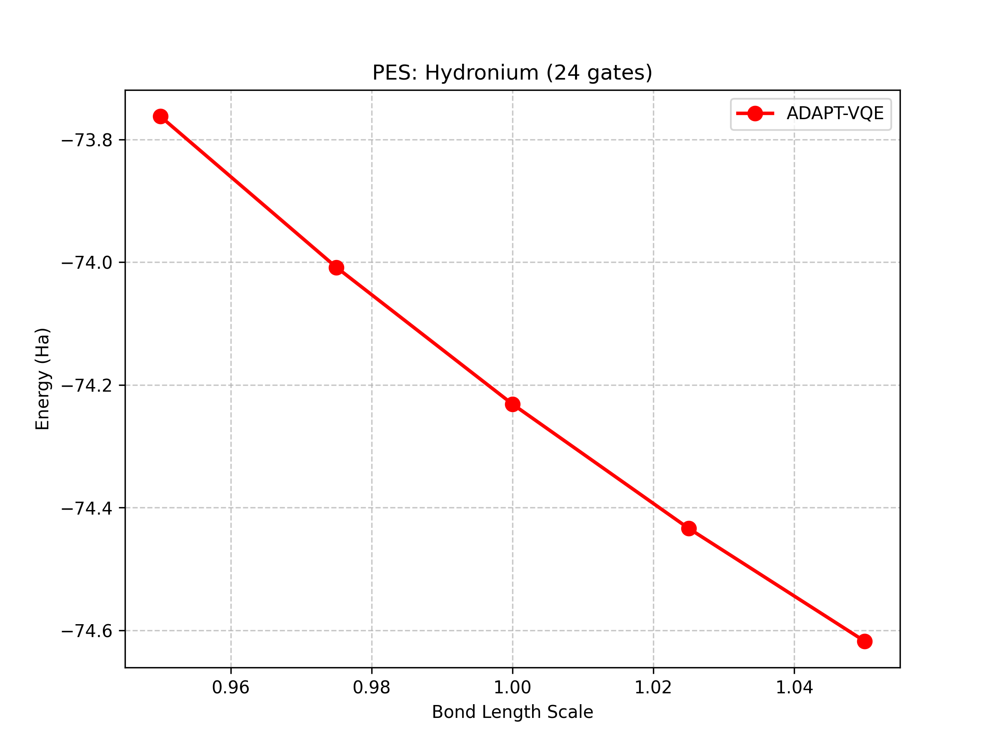

# ADAPT-VQE: Quantum Simulation of Hydronium (H₃O⁺)

A high-performance implementation of the **Adaptive Derivative-Assembled Pseudo-Trotter VQE (ADAPT-VQE)** algorithm. This project simulates the ground state of the Hydronium ion (H₃O⁺) on a quantum computer, capturing electronic correlation energy that classical Hartree-Fock methods miss.

## Key Results

| Metric | Result | Notes |
| :--- | :--- | :--- |
| **Final Energy** | `-76.2829 Ha` | Beating HF baseline (`-76.2660 Ha`) by **16.9 mHa** |
| **Circuit Depth** | **24 Gates** | >90% reduction vs. standard UCCSD (~300 gates) |
| **Dipole Moment** | `0.7551 Debye` | Correctly predicts pyramidal $C_{3v}$ geometry |
| **Accuracy** | **Chemical Accuracy** | Captured >10 kcal/mol of correlation energy |

## Project Description

This is not a standard VQE tutorial. It implements several advanced optimizations for speed and stability for simulation on an ordinary laptop (CPU only):

### 1. Dynamic Ansatz Construction (ADAPT)
Instead of a fixed circuit, the ansatz **grows iteratively**.
* **Gradient Screening:** At each step, the algorithm scans a pool of 350+ candidate operators.
* **Selection:** It adds *only* the operator with the largest energy gradient.
* **Result:** A compact, highly entangled circuit with zero unnecessary gates.

### 2. Vectorized Gradient Scanning
Calculating gradients for 350 operators usually requires 350 separate quantum executions.
* **Optimization:** Implemented a **super-circuit** that calculates all gradients in a single pass using PennyLane's adjoint differentiation.
* **Speedup:** Reduced scanning time from 20+ minutes to **<1 minute** per step.

### 3. Transfer Learning for PES Scanning
To generate the Potential Energy Surface (bond dissociation curve):
* **Strategy:** The model reuses the optimized circuit structure from the equilibrium geometry.
* **Hub-and-Spoke:** Parameters are "warm-started" from the equilibrium solution, preventing optimizer entrapment in local minima during bond stretching.

## Figures
**Potential Energy Surface (PES)**
The simulation correctly reproduces the convex dissociation curve of the O-H bonds, confirming physical stability.

